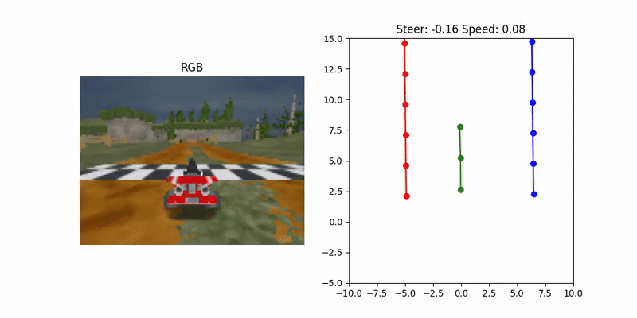
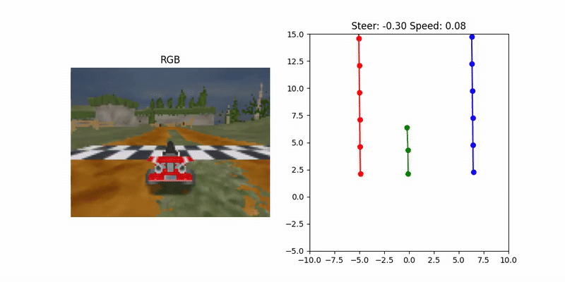

# MLP-Based Vehicle Trajectory Prediction

This project implements an MLP (Multilayer Perceptron) to predict future vehicle waypoints in a simplified driving simulation environment. It demonstrates a complete machine learning pipeline including model design, training, evaluation, and logging.

## 🔧 Features

- Implements a custom PyTorch MLP for trajectory regression
- Supports additional models: CNN and Transformer
- Full training loop with:
  - Smooth L1 loss
  - Metric logging (TensorBoard)
  - Model saving
- Modular and extensible for other input types (e.g., images)

## 🛠 Tech Stack

- Python
- PyTorch
- NumPy
- TensorBoard

## 🚀 Usage

To train a model:
```bash
python train.py --model_name mlp_planner --num_epoch 40 --batch_size 64
```

## 🎥 Model Demos
###  MLP Planner



### CNN Planner



### Transformer Planner


## 📄 Disclaimer
*This project shares only original code written by the author. No university-provided materials, datasets, or assignment instructions are included.*
